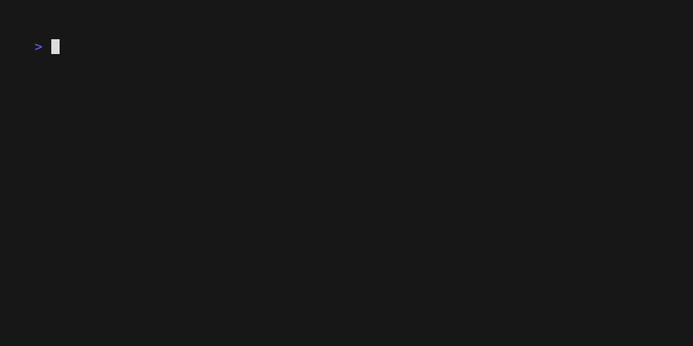

# Bubble Datepicker



## Overview

A custom interactive component for [Bubbletea](https://github.com/charmbracelet/bubbletea) applications. This bubble is designed to offer datepicker functionality similar to the [jQuery Datepicker widget](https://api.jqueryui.com/datepicker) from the web world. Easily select dates within your Bubbletea application!

## Features

- Interactive date selection.
- Customizable appearance.
- Support for keyboard navigation.
- Easily integrates with Bubbletea applications.

## Installation

To use this library in your Bubbletea project, you can add it as a dependency using `go get`:

```bash
go get github.com/ethanefung/bubble-datepicker
```

## Usage

1. Import the library in your Bubbletea application:

   ```go
   import (
       tea "github.com/charmbracelet/bubbletea"
       "github.com/ethanefung/bubble-datepicker"
   )
   ```

2. Create a new instance of the datepicker bubble:

   ```go
   dp := datepicker.New(time.Now())
   dp.SelectDate() // datepicker date is not selected by default
   ```

3. In your `Model` struct, include the datepicker as one of the fields:

   ```go
   type Model struct {
       // Other fields in your model...
       DatePicker datepicker.Model
   }
   ```

4. If not already done so, setup your application `bubbletea.Model` to satisfy the interface:

   ```go
   func (m Model) Init() tea.Model {
       // Initialization logic here...
       return m
   }

   func (m Model) Update(msg tea.Msg) (tea.Model, tea.Cmd) {
       // Update logic here...
       return m, nil
   }

   func (m Model) View() string {
       // View logic here...
       return ""
   }
   ```

5. In your `View` method, include the datepicker view:

   ```go
   func (m Model) View() string {
       // Other view elements...

       // Include the datepicker component
       dpView := m.DatePicker.View()
       return fmt.Sprintf("%s\n%s", otherViews, dpView)
   }
   ```

6. Finally, handle user interactions and updates in your `Update` method. Utilize the datepicker's `.Update` function for sane defaults and/or interact directly with the bubble using a plethora of the datepicker's Methods:

   ```go
   func (m Model) Update(msg tea.Msg) (tea.Model, tea.Cmd) {
       // Handle datepicker events and updates
       dp, cmd := m.DatePicker.Update(msg)
       m.DatePicker = dp

       // or just modify the datepicker directly
       xmas := time.Date(2023, time.December, 25, 0, 0, 0, 0, time.UTC)
       m.DatePicker.SetTime(xmas)

       // Your other update logic here...

       return m, cmd
   }
   ```

You can customize the appearance and behavior of the datepicker component by modifying its settings and styles. For more detailed usage and customization options, refer to the library's [documentation](https://github.com/ethanefung/bubble-datepicker).

## Examples

To see examples of how to use this datepicker component in a Bubbletea application, check the [examples](./examples/) directory in the library's repository.

## License

This library is licensed under the MIT License. See the [LICENSE](LICENSE) file for details.

## Contributing

We welcome contributions! If you find a bug or have an enhancement in mind, please open an issue or create a pull request on the [GitHub repository](https://github.com/ethanefung/bubble-datepicker).

## Support

If you have any questions or need assistance, please feel free to reach out to me.

## Acknowledgments

This library was inspired by the jQuery Datepicker widget and is made possible thanks to the Bubbletea framework and the open-source community.

Happy coding with your new bubble datepicker! 📅🎉
